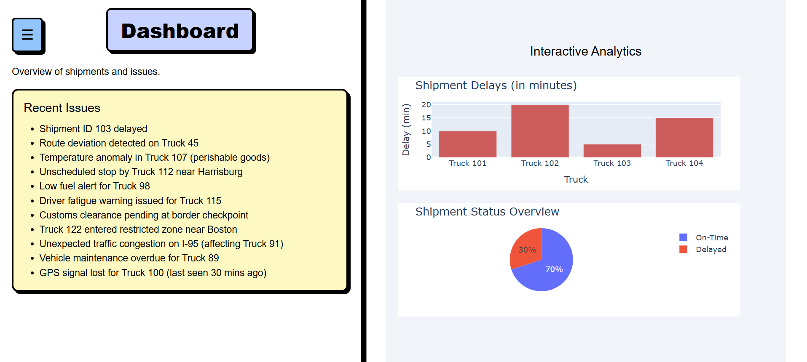

# Disrupt AI - Intelligent Supply Chain Monitoring

Disrupt AI is a real-time logistics monitoring and decision-making dashboard that helps you navigate supply chain disruptions by analyzing **live news**, extracting **location-based threats**, and suggesting **alternative routes** — all visualized on an **interactive map**.

---

## Problem Statement

> **Logistics systems lack real-time awareness of external disruptions** such as protests, strikes, or natural disasters. These delays cost time, money, and reliability — especially when the system isn’t built to adapt quickly.

---

## Our Solution

Disrupt AI fuses **natural language processing**, **mapping**, and **smart rerouting** to help logistics managers make **faster and better decisions**. Here's how:

- **Live news ingestion and analysis** to detect disruptions
- **Interactive Map** showing disrupted and safe routes
- **Animated vehicle simulation** across current and alternative paths
- **Alerts panel** with suggestions and summaries
- Built on **Django + Leaflet.js + JavaScript animations**

---

## Key Features

### Map View
- Real-time plotting of truck positions
- Red route → NYC to Philly (disrupted)
- Green route → NYC → Allentown → Philly (alternative)
- Trucks animate from NYC to Boston and Scranton
- Disturbance icons auto-update based on incoming news

### Alerts Page
- List of all alerts triggered by keyword/location detection
- Suggestions such as: reroute, hold shipment, notify manager

### Dashboard
- Visual graphs of what went wrong where
- Supply chain health summary (failures, delays, optimized paths)

### Backend Logic
- NLP-based location extraction from news headlines
- Django views render different pages: `map`, `dashboard`, `alerts`, `settings`
- Data flow between Python backend and JS frontend via JSON API

---

## Tech Stack

| Component | Tech Used |
|----------|------------|
| Frontend | HTML/CSS, JavaScript, Leaflet.js |
| Backend  | Django (Python) |
| NLP/Parsing | spaCy, regex, custom keyword match |
| APIs     | News API for live headlines |
| Animation | Leaflet + JS intervals |
| Hosting  | (Optional) Deployed on Render/Heroku/Docker etc. |

---

## Contact
Feel free to contact: *agrimajain223@gmail.com*, *bajajnidhi@gmail.com* or *angaddogra1204@gmail.com*. 

---
